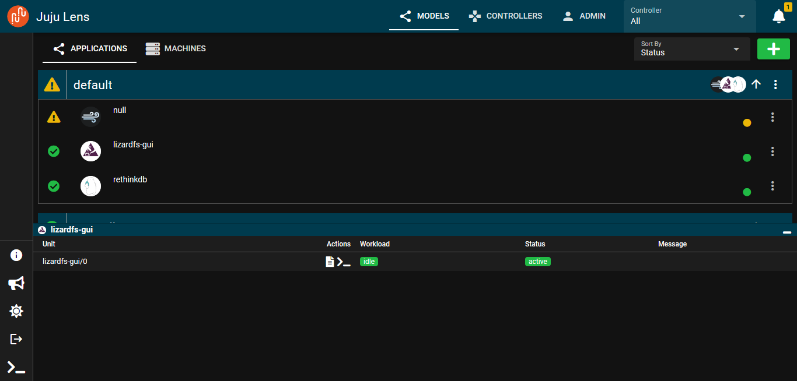
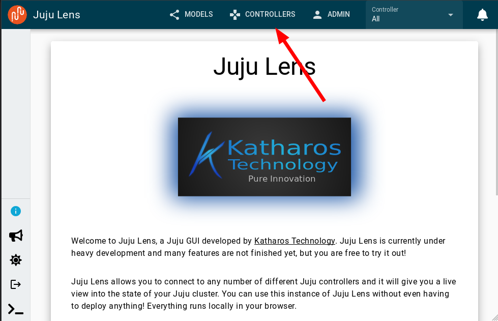
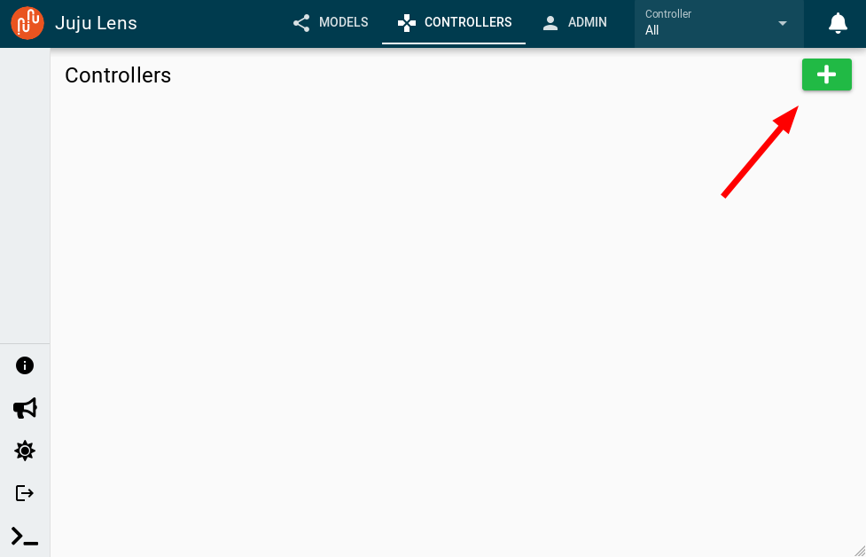
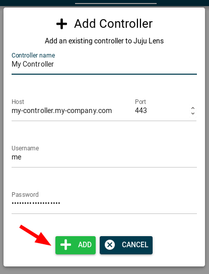
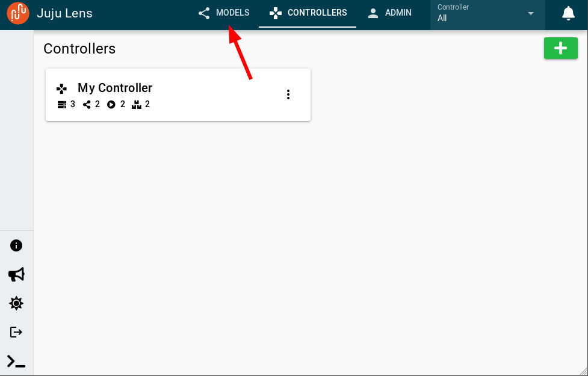
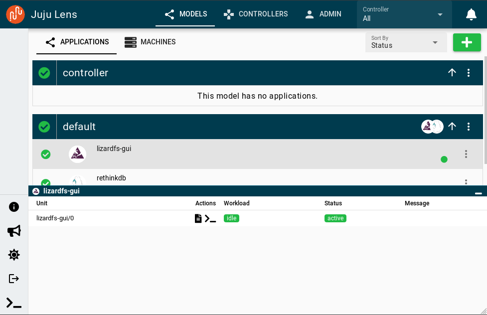
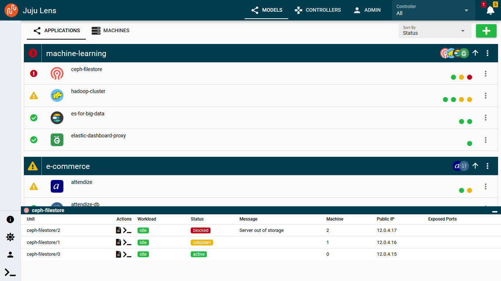
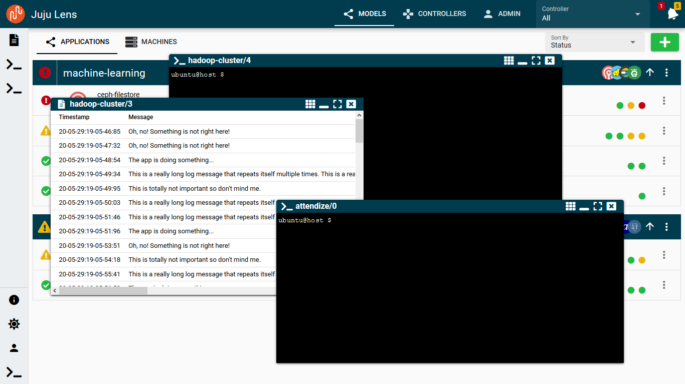
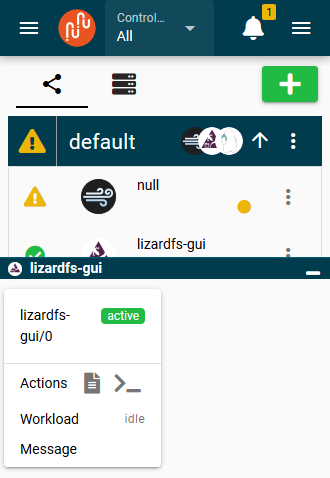

# Juju Lens 

Juju Lens is a new web GUI for the [Juju] orchestration tool with a beautiful interface and support for multiple controllers. Juju Lens is under heavy development, but is usable right now ( see the Getting Started section below ). If you have any ideas or feedback let us know on the [Juju Forum][jf] by creating a topic in the [UX & Design category][jf]. You can also open a GitHub issue.

[juju]: https://jaas.ai/
[jf]: https://discourse.juju.is/c/devel/ux-and-design

## Getting Started

To get started, you don’t need to install anything! ( assuming you already have a Juju controller to connect to. ) Just go to the [Juju Lens App][juju_lens], add one or more controllers, and you’re all set. All data is stored locally in your browser, so if you access the Lens from a different browser you will have to re-add your controllers.

[juju_lens]: https://juju-lens.katharostech.com

### Adding a controller

To add a controller, first go to the Controllers tab:

Then click the big plus button:

Fill out the form and click Add:

Juju Lens will connect to your controller and display the number of machines, models, applications, and units in the controller list. Then click on the models tab:

Juju Lens will show you all your models and units!

## Features

- Multi-controller support
  - View models across controllers or filter by specific controllers
- Alert menu to bring you quickly to problems and warnings
- Sorted lists for models, applications, and units that automatically bring errors and warnings to the top of the list
- Pleasant animations and UI components
- Beautiful dark and light themes
- Ridiculously mobile optimized
- Never have to deploy it, ever!
  - No need to find servers, setup a domain, or pick a Juju controller to deploy it to, just use it right from the [official deployment][juju_lens] or the [desktop application][desktop_app] and monitor any number of controllers!
- ( WIP ) Floating, dragable log and temrinal windows that can minimize to a taskbar
- ( WIP ) Ability to add and edit models, applications, units, etc. from the GUI

[desktop_app]: https://github.com/katharostech/juju-lens/releases/tag/working-desktop-app

## Gallery

**App unit view:**

**Floating, dragable log and terminal windows:**

**Ridiculously mobile optimized:**

